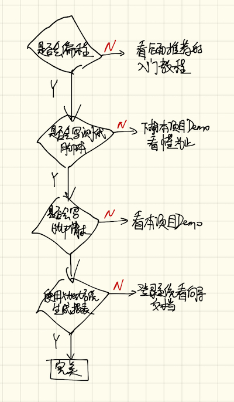
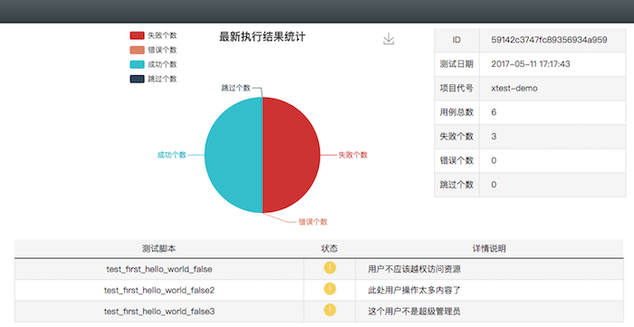
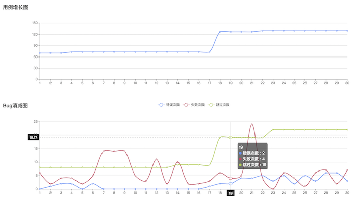

# 基本介绍


一个完整的,自动化测试过程:

1. 编写自动化代码
2. 运行自动化代码
1. 提取测试结果
1. 上传测试结果
1. 图表化展示结果


# xtest项目配置信息

在使用本程序之前，请先在 [xtest](http://xtest.apiapp.cc) 系统中注册，
```
http://xtest.apiapp.cc
```


在 [Xtest系统](http://xtest.apiapp.cc) 中获取本项目（xtest-python-demo）的配置信息：

```
project_id = 590c2a0947fc894a51f9e616
app_id = 3832f354872411e6a7c700163e006b26
app_key = 38342936872411e6a7c700163e006b26

```

修改本项目中的 `./apps/xtest_cfg.py` 中的配置参数。

# 运行环境

- python3.5


# 使用流程



# 文件介绍


- `./xtest/sdk.py`
    对接口进行的封装和一些工具函数，使用的库文件
- `apps`
    接口测试的项目

    - start.py 测试项目运行
    - xtest_cfg 测试项目线上报告系统配置


# 说明


接口的使用规范。


# 使用方法

```
cd xtest-python-demo
./install.sh
```

这样 xtest 的sdk就安装成功了。


运行起示例的方法：

1. 将 `app_id`,`app_key`,`pro_id`替换成自己在系统中注册的账号提供的内容
1. 直接运行此文件

```
cd xtest-python-demo
python apps/start.py
```

然后就可以在 xtest 系统中看到`测试报告图表`了 :

[点击这里查看](http://xtest.apiapp.cc/utest-report-share.html?stoken=2d1f91004a6711e7a6a000163e006b2607ca9d5b)



然后随着一次次发布版本，进行测试，可以形成`项目的成长曲线` :

[点击这里查看](http://xtest.apiapp.cc/pro-report-share.html?stoken=09d6065e49c011e7927a00163e006b26104f31e2)




因为本demo是使用的作者的账号组织的配置，所以数据都在作者的账号系统里面，有兴趣观看的朋友，可以通过如下步骤进行查看：

1. 打开 [xtest.apiapp.cc](xtest.apiapp.cc)
2. 扫码登录
3. 在同一浏览器里面新tab页面里面打开[邀请链接](http://api.apiapp.cc/account/accept-org-invite-by-link/?invite_code=ade39bae403211e7955a00163e006b26)
4. 成为demo演示组的成员
5. 即可完全看到相应的数据
6. 如果想退出此组织，直接点击退出按钮


# 友情链接


[使用文本文件写自动化测试用例](https://github.com/TesterlifeRaymond/doraemon)

```
https://github.com/TesterlifeRaymond/doraemon
```

[一个用来模拟服务器端返回请求的测试平台,也可以用于档板测试](http://git.oschina.net/pinghailinfeng/nbmock)


```
http://git.oschina.net/pinghailinfeng/nbmock
```


# 项目实战

为了让本项目有更实际的意义，所以决定将 xtest 这个系统的接口自动化测试项目给开源出来，大家可以一起看和点评，同时可以一起来写。

`./apps/` 目录下面就是 `xtest` 项目的接口自动化测试项目，用例在逐渐增加中，希望本测试项目和功能项目同步成长，让大家一起见证

一直苦于没有接口自动化项目实战经验的朋友，欢迎加入和讨论。

如果有兴趣一起交流的的朋友，可以加入 `互联网软件测试开发QQ群` ：`207548681`

     

# 资料分享

如果有对测试开发还没入门的小白用户，这里面有`免费`的精品资料（精美文档和视频资料）。

[基于python的互联网软件测试开发（自动化测试）-全集合](http://www.cnblogs.com/beer/p/6381327.html)

```
http://www.cnblogs.com/beer/p/6381327.html
```

没错，我就是活雷锋，你来咬我啊！

# 发布公告


## 1.17.5.25.1

- 第二版的demo
- 以项目组织的多文件
- 开始准备写大型的测试项目了
- 加入了对版本信息的api的测试用例


## 1.16.10.21.1

- 第一版的demo
- 单个文件的test项目